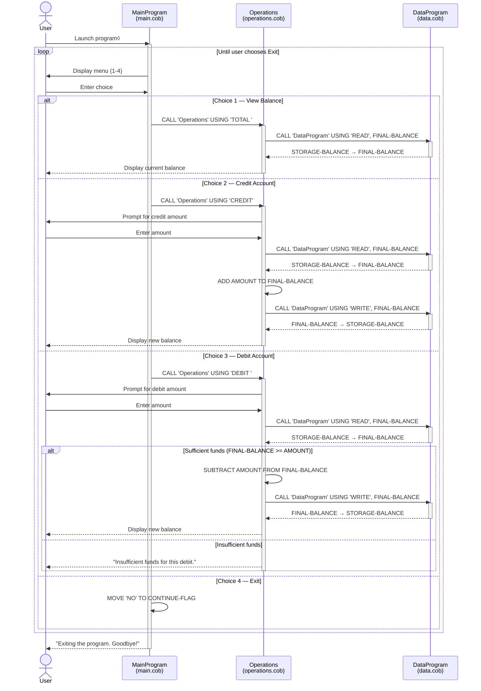

# COBOL Account Management System

This legacy COBOL application implements a simple student account management system supporting balance enquiry, credits, and debits.

---

## File Overview

### `src/cobol/main.cob` — Entry Point (`MainProgram`)

The main program loop. Presents a text menu to the user and dispatches actions by calling `Operations` with an operation code.

**Menu options:**

| Choice | Operation code | Action |
|--------|---------------|--------|
| 1 | `TOTAL ` | View current balance |
| 2 | `CREDIT` | Credit (deposit) an amount |
| 3 | `DEBIT ` | Debit (withdraw) an amount |
| 4 | — | Exit the program |

---

### `src/cobol/operations.cob` — Business Logic (`Operations`)

Handles all account operations. Called by `MainProgram` with a 6-character operation code. Interacts with `DataProgram` to read and write the persistent balance.

**Key functions:**

- **TOTAL** — Reads the current balance via `DataProgram` and displays it.
- **CREDIT** — Prompts for an amount, reads the current balance, adds the amount, and writes the updated balance back.
- **DEBIT** — Prompts for an amount, reads the current balance, and subtracts the amount only if sufficient funds exist; otherwise displays an error.

**Business rules:**

- A debit is only processed when `FINAL-BALANCE >= AMOUNT`. If funds are insufficient, the transaction is rejected with the message *"Insufficient funds for this debit."*
- The initial balance is seeded at **1000.00** in working storage (used as a fallback before any `WRITE` has occurred).
- Operation codes are exactly **6 characters** (note the trailing space in `TOTAL ` and `DEBIT `); mismatched codes will silently result in no operation being performed.

---

### `src/cobol/data.cob` — Data Access Layer (`DataProgram`)

Manages in-memory persistence of the account balance. Acts as a simple data store using `STORAGE-BALANCE` in working storage.

**Key functions:**

- **READ** — Copies `STORAGE-BALANCE` into the passed `BALANCE` field.
- **WRITE** — Copies the passed `BALANCE` field into `STORAGE-BALANCE`.

**Business rules:**

- The balance field is defined as `PIC 9(6)V99`, supporting values from **0.00 to 999999.99**.
- The default initial balance is **1000.00**.
- There is no file or database persistence; the balance resets to the initial value every time the program is started.

---

## Call Hierarchy

```
MainProgram (main.cob)
  └── Operations (operations.cob)
        └── DataProgram (data.cob)
```

---

## Data Flow Sequence Diagram


